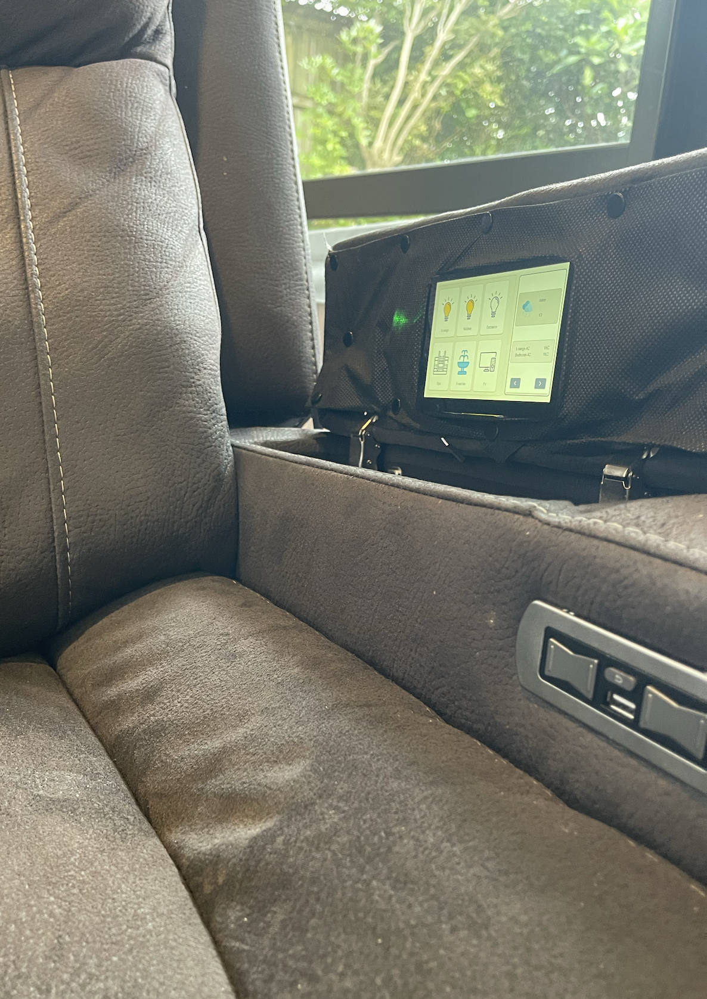

# ESPHome YAML Configuration Examples

This repository contains a collection of ESPHome YAML configuration examples for various ESP32-based smart home devices. These configurations demonstrate different approaches to building custom smart home displays and control interfaces using ESPHome.

Readme generated by Claude

## Overview

ESPHome is a system to control ESP8266/ESP32 devices with simple yet powerful configuration files and control them remotely through Home Assistant. This repository shares real-world configurations that can serve as templates or inspiration for your own ESPHome projects.

## Configuration Files

### chair-display.yaml - Advanced LVGL Touch Display

The `chair-display.yaml` configuration is designed for an ESP32-S3 based touch display system with LVGL (Light and Versatile Graphics Library) integration. This is used as a custom chair-mounted display panel with advanced graphics capabilities.

#### Key Features:
- **Hardware Platform**: ESP32-S3 DevKitC-1 with PSRAM support
- **Display Framework**: LVGL for advanced UI rendering
- **Memory Configuration**:
  - Octal PSRAM running at 80MHz for extended memory
  - Optimized ESP-IDF settings for performance (240MHz CPU, 64KB cache)
- **Modular Design**: Uses package includes for organization (currently referenced but not present in repo):
  - `cd_fonts_images.yaml` - Font and image resources
  - `cd_lvgl.yaml` - LVGL display configuration
  - `cd_hardware.yaml` - Hardware pin definitions and setup
  - `cd_sensors.yaml` - Sensor integrations
  - `cd_substitutions.yaml` - Variable substitutions

#### Connectivity:
- WiFi with fallback AP mode for initial setup
- Home Assistant API integration with encryption
- OTA updates with password protection
- Web server on port 80 for local access
- Captive portal for easy WiFi configuration

#### Security Note:
The configuration references secrets for WiFi credentials, API encryption key, and OTA password, properly separating sensitive data from the main configuration.

#### Screenshots:



### lanbonl8.yaml - Lanbon L8 Smart Switch Display

The `lanbonl8.yaml` configuration is for a Lanbon L8 smart switch.

#### Device Overview:
The Lanbon L8 is a commercial smart switch with:
- 240x320 MIPI SPI color display
- FT63x6 capacitive touch controller
- Three built-in relays for switching
- RGB mood lighting
- Adjustable backlight

#### Climate Control Interface:
This configuration creates a complete HVAC control panel featuring:

##### Display Components:
- **Temperature Control**: Interactive spinbox for setting target temperature (16-30°C range)
- **Power Management**: Toggle button for system on/off with visual state indication
- **Mode Selection**: Buttons for Auto, Cool, and Heat modes
- **Fan Speed Control**: Auto, Low, Medium, and High fan speed options
- **Status Display**: Real-time display of current temperature, active mode, and fan settings

##### Smart Features:
- **Home Assistant Integration**:
  - Syncs with a Home Assistant climate entity
  - Real-time bidirectional updates
  - Service calls for all climate operations
- **Automatic Display Timeout**: Configurable screen timeout (10-180 seconds) to save power
- **Touch Wake**: Display automatically wakes on touch interaction
- **Visual Feedback**: Active buttons highlighted in blue, inactive in grey

##### Hardware Interfaces:
- **SPI Display**: CLK (GPIO19), MOSI (GPIO23), MISO (GPIO25), CS (GPIO22), DC (GPIO21), Reset (GPIO18)
- **I2C Touch**: SDA (GPIO4), SCL (GPIO0)
- **Relays**: GPIO12, GPIO14, GPIO27 for three independent switches
- **Lighting**:
  - Backlight PWM on GPIO5
  - RGB mood light on GPIO26 (Red), GPIO32 (Green), GPIO33 (Blue)

##### LVGL Implementation:
- Custom styled UI with professional appearance
- Flex layouts for responsive button arrangement
- Optimized buffer size (75%) for smooth animations
- Touch calibration for accurate input
- Idle detection for power management

#### Use Cases:
This configuration is ideal for:
- Bedroom or room-specific climate control
- Replacement of traditional thermostats
- Integration with smart HVAC systems
- Multi-zone temperature management

## Security Considerations

Both configurations properly utilize ESPHome's secrets management:
- WiFi credentials stored in `secrets.yaml`
- API encryption keys for secure communication
- OTA passwords for protected updates
- Fallback AP passwords are hardcoded but should be changed for production use

## Installation

1. Install ESPHome on your system
2. Copy the desired YAML configuration
3. Create a `secrets.yaml` file with your credentials:
   ```yaml
   wifi_ssid: "YourWiFiSSID"
   wifi_password: "YourWiFiPassword"
   api_encryption_key: "your-base64-encoded-32-byte-key"
   ota_password: "YourOTAPassword"
   ```
4. Compile and upload to your ESP32 device

## Contributing

Feel free to submit issues or pull requests with improvements or additional configuration examples.

## License

These configuration examples are shared for educational and reference purposes. Please ensure you comply with all relevant licenses when using third-party libraries like LVGL.